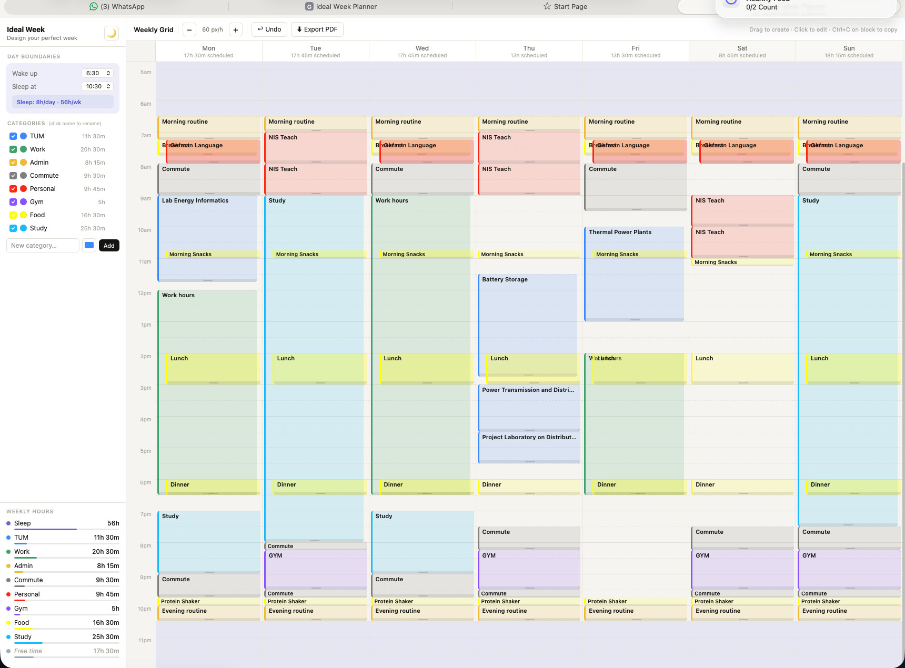

# Ideal Week Planner

A lightweight, single-file web app for designing your perfect week. No backend, no account, no installation — just open the HTML file in any browser and start planning.

🌐 **[Live demo → aidyn-ardabek.github.io/Ideal-Week-Planner](https://aidyn-ardabek.github.io/Ideal-Week-Planner/)**

---

---

## What is this?

Ideal Week Planner is not a task manager or a calendar. It is a **thinking tool** — a place to design a hypothetical week and answer questions like:

- How many hours per week can I realistically dedicate to studying?
- How much of my waking time is already consumed by commuting and eating?
- How much genuine free time do I have after everything is accounted for?

The idea comes from the concept of an "ideal week" — a template week you design intentionally, rather than one that just happens to you.

---

## Features

### Grid
- 7-day weekly grid (Monday–Sunday)
- Drag on any column to create a time block — snaps to 15-minute intervals
- Click any block to edit it
- Drag a block to move it (snaps to 15 minutes)
- Drag the bottom edge of a block to resize it freely
- Overlapping blocks are displayed side by side with increasing color intensity per depth level
- Hover over empty space to see how much free time is in that gap

### Zoom
- Zoom in and out with `+` / `−` buttons in the toolbar
- Range from 24 px/hour (full week overview) to 200 px/hour (fine detail)
- Half-hour time labels appear automatically at higher zoom levels

### Sleep & Day Boundaries
- Set your wake-up and sleep times in the sidebar
- Time outside those boundaries is shaded as sleep on the grid
- Sleep hours are calculated and displayed per day and per week

### Categories
- Six default categories: Study, Work, Food, Commute, Personal, Gym
- Click the colored dot to change a category's color
- Click the category name to rename it inline
- Toggle categories on/off to filter the grid
- Add custom categories with any name and color
- Deleting a category is undoable

### Blocks
- Each block has a title, category, and optional notes
- Notes appear inside the block beneath the title
- Very short blocks show a hover tooltip with title and time range instead

### Copy & Paste
- `Ctrl+C` (or `Cmd+C` on Mac) while clicking a block copies it
- A banner appears — click any day header to paste the block there at the same time
- You can paste to multiple days before pressing `Esc` to exit paste mode
- Use the **"Also copy to days"** chips in the edit modal to repeat a block across multiple days at once

### Duplicate
- Open any block and click **Duplicate** to create a copy immediately after it on the same day

### Undo
- `Ctrl+Z` (or `Cmd+Z`) undoes the last action
- Covers: create, move, resize, delete, duplicate, category deletion
- Up to 60 steps of history per session

### Weekly Analysis (sidebar)
- Live hours breakdown per category
- Total sleep hours per week
- **Free time** — awake hours minus all scheduled blocks, with overlapping blocks counted only once
- All stats update as you edit the grid

### Dark Mode
- Toggle with the 🌙 button in the sidebar header
- Preference is saved and restored on next visit

### Export
- Click **⬇ Export PDF** to open the browser print dialog
- Choose "Save as PDF" — exports the full grid including the sidebar
- Optimised for A3 landscape

### Data
- Everything is saved automatically in your browser's `localStorage`
- No account, no server, no data leaves your device
- Data persists between sessions on the same browser

---

## Getting Started

### Option 1 — Use it locally
1. Download `ideal-week-planner.html`
2. Open it in any modern browser (Chrome, Firefox, Safari, Edge)
3. Start planning

### Option 2 — Host it yourself (free)

**Netlify Drop** (easiest, no account needed):
1. Go to [netlify.com/drop](https://netlify.com/drop)
2. Drag and drop the HTML file
3. Get a shareable URL instantly

**GitHub Pages**:
1. Fork or clone this repo
2. Go to Settings → Pages
3. Set source to the root of your `main` branch
4. Your planner will be live at `https://yourusername.github.io/repo-name`

---

## Keyboard Shortcuts

| Shortcut | Action |
|---|---|
| `Ctrl+Z` / `Cmd+Z` | Undo last action |
| `Ctrl+Click` / `Cmd+Click` on a block | Copy block |
| `Esc` | Exit paste mode / close modal |

---

## Design Philosophy

- **Single file** — the entire app is one `.html` file with no external dependencies, no build step, and no framework. You can read, edit, and share the whole thing.
- **No complexity** — no recurring events, no notifications, no sync, no AI scheduling. Just a grid and blocks.
- **Local first** — your data never leaves your browser.

---

## Browser Support

Works in any modern browser. Tested in Chrome, Firefox, Safari, and Edge.
Internet Explorer is not supported.

---

## License

MIT — do whatever you want with it.
